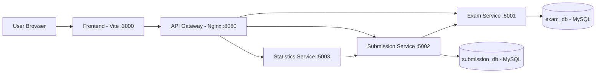

# Online Quiz Microservices System

He thong thi trac nghiem theo kien truc microservices.  
This project implements an online quiz platform using a microservices architecture.

## Team Members

| Name | Student ID | Role | Contribution |
|------|------------|------|-------------|
| Nguyen Minh Hong | B22DCCN409 | TV1 | Exam Service (question bank, exam management) |
| (Update) | (Update) | TV2 | Submission Service (exam session, grading) |
| (Update) | (Update) | TV3 | Statistics Service + Teacher analytics dashboard |

## Business Scope

- **Actors / Tac nhan**: Teacher, Student.
- **Teacher flow**: tao cau hoi, tao de thi, cong bo/dong de, xem thong ke ket qua.
- **Student flow**: bat dau lam bai, luu dap an, nop bai, xem ket qua.
- **System goal**: tach nghiep vu theo service de de phat trien, test va trien khai.

## Architecture



| Component | Responsibility | Tech Stack | Port |
|---|---|---|---|
| `frontend` | Teacher/Student UI | React + Vite | 3000 |
| `gateway` | Single API entrypoint, routing | Nginx | 8080 |
| `exam-service` | Questions, exams, exam status | Spring Boot + MySQL | 5001 |
| `submission-service` | Exam session, answers, auto grading | Spring Boot + MySQL | 5002 |
| `statistics-service` | Overview, question analytics, leaderboard | Spring Boot (stateless) | 5003 |
| `exam-db` | Database of exam-service | MySQL 8.0 | 3306 (host) |
| `submission-db` | Database of submission-service | MySQL 8.0 | 3307 (host) |

## Repository Structure

```text
.
├── docker-compose.yml
├── .env.example
├── frontend/
├── gateway/
├── services/
│   ├── exam-service/
│   ├── submission-service/
│   └── statistics-service/
└── docs/
    └── api-specs/
```

## Quick Start

### 1) Prerequisites

- Docker Desktop (with Docker Compose)
- Git

### 2) Run full system

```bash
# from project root
cp .env.example .env
docker compose up --build -d
```

> PowerShell tren Windows: `copy .env.example .env`

### 3) Access URLs

- Frontend: `http://localhost:3000`
- API Gateway: `http://localhost:8080`
- Exam Service: `http://localhost:5001`
- Submission Service: `http://localhost:5002`
- Statistics Service: `http://localhost:5003`

## Health Check

```bash
curl http://localhost:8080/health            # gateway
curl http://localhost:5001/actuator/health   # exam-service
curl http://localhost:5002/health            # submission-service
curl http://localhost:5003/health            # statistics-service
```

## API Documentation (OpenAPI)

- [Exam Service Spec](docs/api-specs/exam-service.yaml)
- [Submission Service Spec](docs/api-specs/submission-service.yaml)
- [Statistics Service Spec](docs/api-specs/statistics-service.yaml)

## Service Notes

- Services communicate via Docker DNS names (`exam-service`, `submission-service`, `statistics-service`), not localhost.
- `statistics-service` is stateless and reads data from `submission-service`.
- Frontend in Docker is configured with internal proxy targets and startup wait to reduce early fetch failures.

## Common Commands

```bash
docker compose ps                 # show service status
docker compose logs -f gateway    # follow gateway logs
docker compose down               # stop all services
docker compose down -v            # stop and remove volumes
```

## Troubleshooting

- **Port already allocated**: doi port trong `.env` (vd `SUBMISSION_DB_PORT=3310`) hoac dung container dang chiem port.
- **Frontend "Failed to fetch" khi vua khoi dong**: doi 10-20 giay de backend healthy, sau do refresh lai.
- **Data khong hien tren dashboard**: kiem tra dung `examId`, va kiem tra service health o muc tren.

## License

This project uses the [MIT License](LICENSE).

