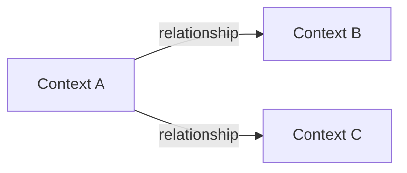
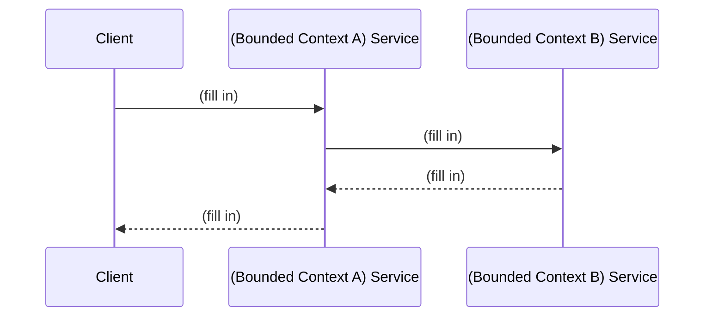
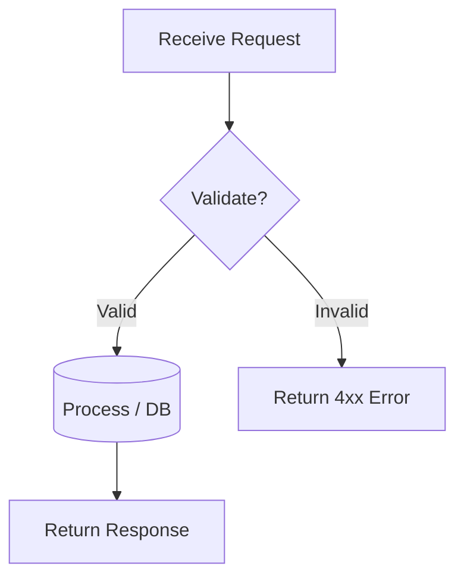

# Analysis and Design — Domain-Driven Design Approach

> **Goal**: Analyze a specific business process and design a service-oriented automation solution using Domain-Driven Design.
> **Scope**: 4–6 week assignment — focus on **one business process**, not an entire system.
>
> **Alternative to**: [`analysis-and-design.md`](analysis-and-design.md) (Step-by-Step Action approach).
> Choose **one** approach, not both. Use this if your team prefers discovering service boundaries through **domain knowledge and business semantics** rather than action decomposition.

**References:**
1. *Domain-Driven Design: Tackling Complexity in the Heart of Software* — Eric Evans
2. *Microservices Patterns: With Examples in Java* — Chris Richardson
3. *Bài tập — Phát triển phần mềm hướng dịch vụ* — Hung Dang (available in Vietnamese)

---

### How DDD differs from Step-by-Step Action

| | Step-by-Step Action | DDD (this document) |
|---|---|---|
| **Thinking direction** | Bottom-up: actions → group → service | Top-down: domain → bounded context → service |
| **Service boundary decided by** | Similarity of actions/functions | Semantic boundary of business domain |
| **Best suited for** | Small–medium systems, simple logic | Complex business logic, ≥ 30 use cases |
| **Key risk** | Services may be fragmented by technical logic | Requires deep domain understanding upfront |

Both approaches lead to a list of services with clear responsibilities. DDD produces services aligned with *business boundaries* — changes in one business area only affect the corresponding service.

### Progression Overview

| Step | What you do | Output |
|------|------------|--------|
| **1.1** | Define the Business Process | Process diagram, actors, scope |
| **1.2** | Survey existing systems | System inventory |
| **1.3** | State non-functional requirements | NFR table |
| **2.1** | Build a shared domain vocabulary | Ubiquitous Language glossary |
| **2.2** | Discover Domain Events via Event Storming | Chronological event list |
| **2.3** | Identify Commands and Actors | Command → Event mapping |
| **2.4** | Form Aggregates from related Commands/Events | Aggregate table with owned data |
| **2.5** | Draw Bounded Contexts around Aggregates | Bounded Context → service candidate |
| **2.6** | Map relationships between Bounded Contexts | Context Map diagram + relationship table |
| **2.7** | Design service interactions | Service composition diagram |
| **3.1** | Specify service contracts | OpenAPI endpoint tables |
| **3.2** | Design internal service logic | Flowchart per service |

---

## Part 1 — Domain Discovery

### 1.1 Business Process Definition

Describe the **one** business process your team will automate. Keep scope realistic for 4–6 weeks.

- **Domain**: *(e.g., Online Food Delivery, University Course Registration, ...)*
- **Business Process**: *(e.g., "Customer places an order and receives delivery")*
- **Actors**: *(e.g., Customer, Restaurant Owner, Delivery Driver)*
- **Scope**: *(e.g., "From order placement to delivery confirmation — excluding payment settlement")*

**Process Diagram:**

*(Insert BPMN, flowchart, or image into `docs/asset/` and reference here)*

> 💡 **Tip:** A good scope for this assignment is a process with 5–15 steps and 2–4 actors. If your process has more than 20 steps, narrow the scope.

### 1.2 Existing Automation Systems

List existing systems, databases, or legacy logic related to this process.

| System Name | Type | Current Role | Interaction Method |
|-------------|------|--------------|-------------------|
|             |      |              |                   |

> If none exist, state: *"None — the process is currently performed manually."*

### 1.3 Non-Functional Requirements

Non-functional requirements help justify design decisions in later steps (e.g., why a particular bounded context deserves an independent service).

| Requirement    | Description |
|----------------|-------------|
| Performance    |             |
| Security       |             |
| Scalability    |             |
| Availability   |             |

---

## Part 2 — Strategic Domain-Driven Design

> In DDD, we work **top-down**: understand the domain first, then let the business structure guide how we split services. This contrasts with the Step-by-Step approach which works bottom-up from individual actions.

### 2.1 Ubiquitous Language

Before diving into events and commands, build a **shared vocabulary** — the Ubiquitous Language. This ensures everyone (developer, BA, domain expert) uses the same terms consistently.

> 💡 **How to do it:** List every important noun and verb that appears when you describe the business process. Give each term a precise definition. Avoid synonyms — pick one term and stick with it.

| Term | Definition | Example |
|------|-----------|---------|
| *(e.g., Order)* | *(A request from a customer to purchase one or more menu items)* | *(Customer places an Order containing 2 pizzas)* |
| *(e.g., Fulfillment)* | *(The process of preparing and delivering an order to the customer)* | *(Restaurant marks the Order as ready for Fulfillment)* |
|      |           |         |

> ⚠️ **Common mistake:** Using the same word with different meanings in different contexts (e.g., "Account" means a user profile in one place but a financial ledger in another). If this happens, it's a strong signal that you have **two Bounded Contexts**.

### 2.2 Event Storming — Domain Events

**Domain Events** are things that **have happened** in the business process. Write them in **past tense**.

> 💡 **How to do it:** Walk through the business process from start to finish. At each step, ask: *"What just happened that the business cares about?"* Write it down as a Domain Event. Don't worry about grouping yet — just list them in chronological order.

| # | Domain Event | Description |
|---|-------------|-------------|
| 1 | *(e.g., OrderPlaced)* | *(Customer submitted an order with items and delivery address)* |
| 2 | *(e.g., OrderConfirmed)* | *(Restaurant accepted the order and started preparation)* |
| 3 | *(e.g., PaymentReceived)* | *(Payment for the order was successfully processed)* |
|   |             |             |

> 💡 **How many events?** For a process with 5–15 steps, expect 8–20 domain events. If you have fewer than 5, your process may be too simple; if more than 30, consider narrowing scope.

### 2.3 Commands and Actors

A **Command** is the action that **causes** a Domain Event to happen. Every event should trace back to at least one command.

> 💡 **How to do it:** For each Domain Event in 2.2, ask: *"What action triggered this?"* and *"Who performed that action?"* Use **imperative** form (e.g., "PlaceOrder", not "OrderPlaced").

| Command | Actor | Triggers Event(s) | Description |
|---------|-------|--------------------|-------------|
| *(e.g., PlaceOrder)* | *(Customer)* | *(OrderPlaced)* | *(Customer submits selected items with delivery info)* |
| *(e.g., ConfirmOrder)* | *(Restaurant Owner)* | *(OrderConfirmed)* | *(Restaurant accepts and begins preparing the order)* |
|         |       |                    |             |

> ⚠️ **Check:** Every Domain Event from 2.2 should appear in the "Triggers Event(s)" column at least once. If an event has no command, it might be triggered by another event (event chaining) — note that in the Description.

### 2.4 Aggregates

An **Aggregate** is a cluster of closely related data and behavior, grouped around a **root entity**. The Aggregate enforces business rules for that cluster.

> 💡 **How to do it:** Look at your Commands and Events from 2.2–2.3. Ask: *"Which business entity does this command operate on?"* Commands that modify the same entity and its closely related data belong to the same Aggregate.

| Aggregate | Root Entity | Commands | Domain Events | Key Business Rules |
|-----------|------------|----------|---------------|--------------------|
| *(e.g., Order)* | *(Order)* | *(PlaceOrder, CancelOrder)* | *(OrderPlaced, OrderCancelled)* | *(Order total must be > 0; max 50 items per order)* |
| *(e.g., Payment)* | *(Payment)* | *(ProcessPayment, RefundPayment)* | *(PaymentReceived, PaymentRefunded)* | *(Payment amount must match order total)* |
|           |          |          |               |                    |

> 💡 **Rule of thumb:** If two pieces of data **must be updated together** to keep the business consistent, they belong in the same Aggregate. If they can change independently, they probably belong to different Aggregates.

### 2.5 Bounded Contexts

A **Bounded Context** is a boundary within which the Ubiquitous Language (2.1) has a single, consistent meaning. Each Bounded Context becomes a **service candidate**.

> 💡 **How to do it:** Look at your Aggregates from 2.4. Ask:
> 1. *"Do these Aggregates share the same language/terms with the same meaning?"*
> 2. *"Would they be managed by the same team or business unit?"*
> 3. *"Do they change for the same business reasons?"*
>
> If yes → same Bounded Context. If no → different Bounded Contexts.

| Bounded Context | Aggregates Included | Responsibility | Service Candidate |
|-----------------|---------------------|----------------|-------------------|
| *(e.g., Ordering)* | *(Order, Cart)* | *(Manages the lifecycle of customer orders from placement to completion)* | *(order-service)* |
| *(e.g., Payment)* | *(Payment, Invoice)* | *(Handles all payment processing and financial records)* | *(payment-service)* |
|                 |                     |                |                   |

> ⚠️ **Key signal for separate contexts:** The same word means different things. E.g., "Product" in the Catalog context means name + description + images, while "Product" in the Order context means item ID + quantity + price. This is **two** Bounded Contexts, not one.

> 💡 **For this assignment:** 2–4 Bounded Contexts is a good target. Each Bounded Context will map to one microservice in your implementation.

### 2.6 Context Map

Show how Bounded Contexts communicate with each other. This is the architectural "big picture."

> 💡 **How to fill in:** For each pair of Bounded Contexts in 2.5, determine:
> - **Which one provides data?** → That is Upstream.
> - **Which one consumes data?** → That is Downstream.
> - **What is the nature of the dependency?** → Pick a relationship type.

**Common relationship types for this assignment:**

| Type | When to use |
|------|------------|
| **Upstream / Downstream** | One context provides data that another consumes |
| **Customer / Supplier** | Downstream context requests features from upstream |
| **Anti-Corruption Layer (ACL)** | Downstream translates upstream's model to protect its own model |
| **Open Host Service (OHS)** | Upstream exposes a well-defined API for any consumer |

| Upstream | Downstream | Relationship Type | Data Exchanged |
|----------|------------|-------------------|----------------|
| *(e.g., Ordering)* | *(e.g., Payment)* | *(OHS / Downstream)* | *(Order ID, total amount)* |
|          |            |                   |                |

### 2.7 Service Composition

Show how the identified services interact to fulfill the original business process from 1.1.

> 💡 **How to do it:** Walk through the business process again. For each step, identify which service handles it and what calls are made between services.

> ⚠️ **Check:** Compare this diagram with your Process Diagram in 1.1. Every step in the business process should be covered by at least one service. If a step is not covered, you may be missing a Bounded Context.

---

## Part 3 — Service-Oriented Design

> Part 3 is the **convergence point** — regardless of whether you used Step-by-Step Action or DDD in Part 2, the outputs here are the same: service contracts and service logic.

### 3.1 Uniform Contract Design

Service Contract specification for each Bounded Context / service.
Full OpenAPI specs:
- [`docs/api-specs/service-a.yaml`](api-specs/service-a.yaml)
- [`docs/api-specs/service-b.yaml`](api-specs/service-b.yaml)

> 💡 **Derive from 2.3 and 2.5:** Each Command from 2.3 typically maps to one API endpoint. The Bounded Context (2.5) determines which service owns the endpoint.

**Service A — *(Bounded Context name)*:**

| Endpoint | Method | Description | Request Body | Response Codes |
|----------|--------|-------------|--------------|----------------|
|          |        |             |              |                |

**Service B — *(Bounded Context name)*:**

| Endpoint | Method | Description | Request Body | Response Codes |
|----------|--------|-------------|--------------|----------------|
|          |        |             |              |                |

### 3.2 Service Logic Design

Internal processing flow for each service.

**Service A — *(Bounded Context name)*:**

**Service B — *(Bounded Context name)*:**

