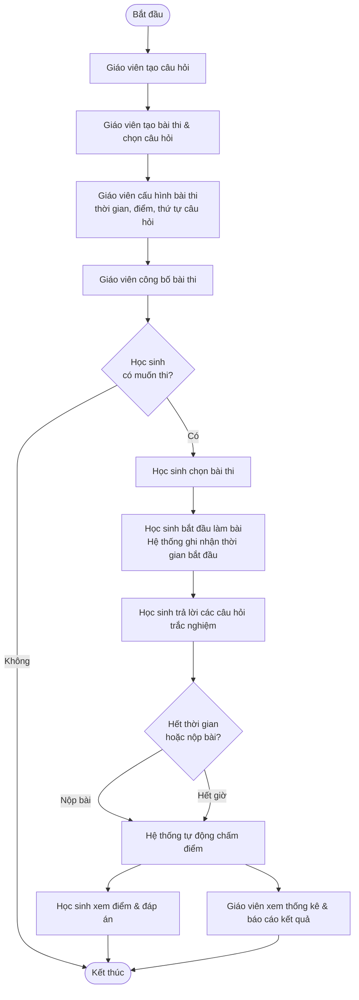
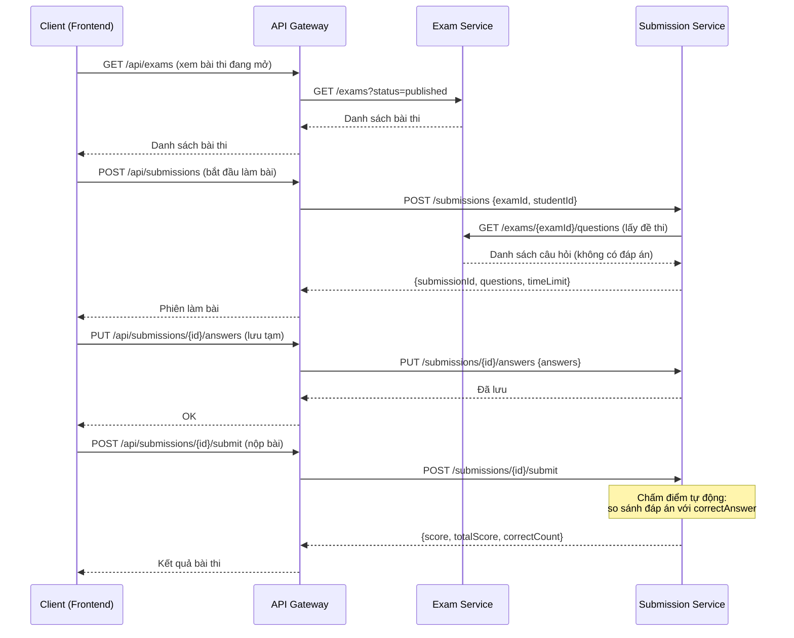
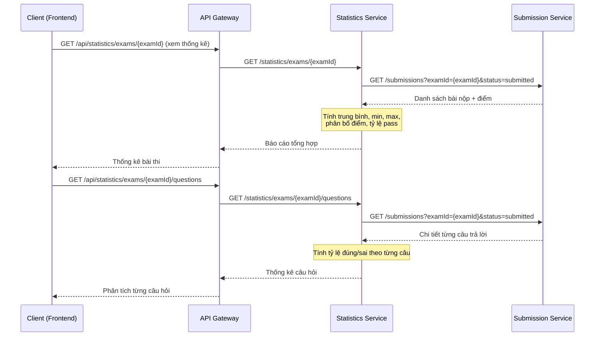
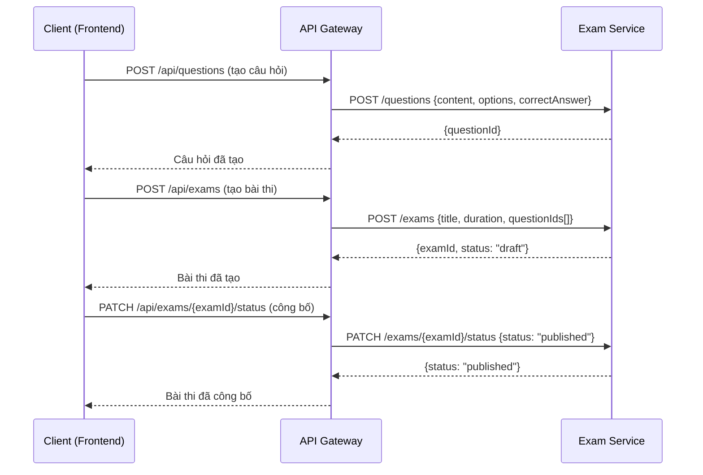
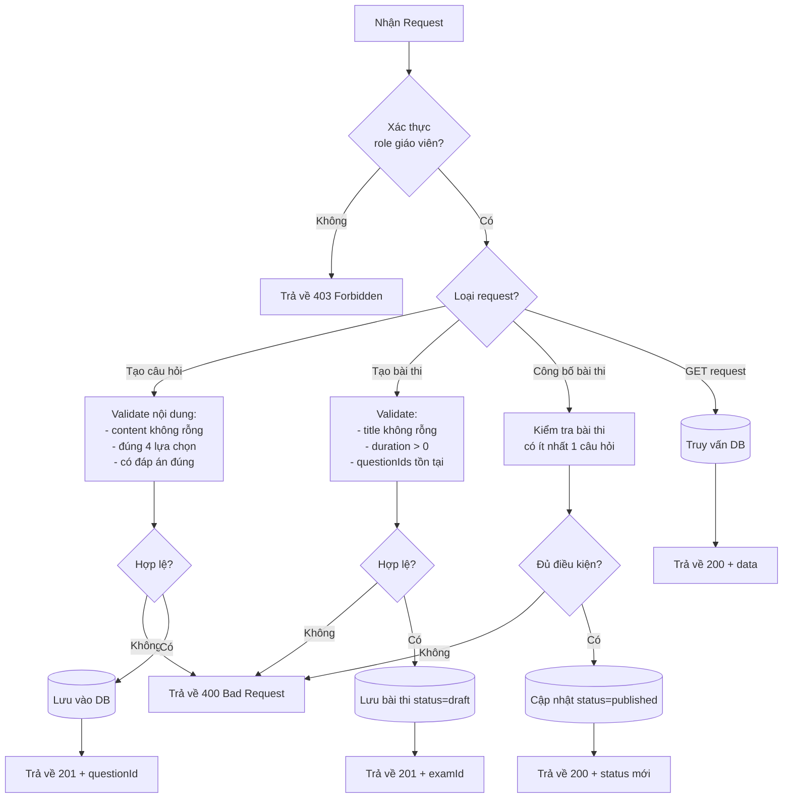
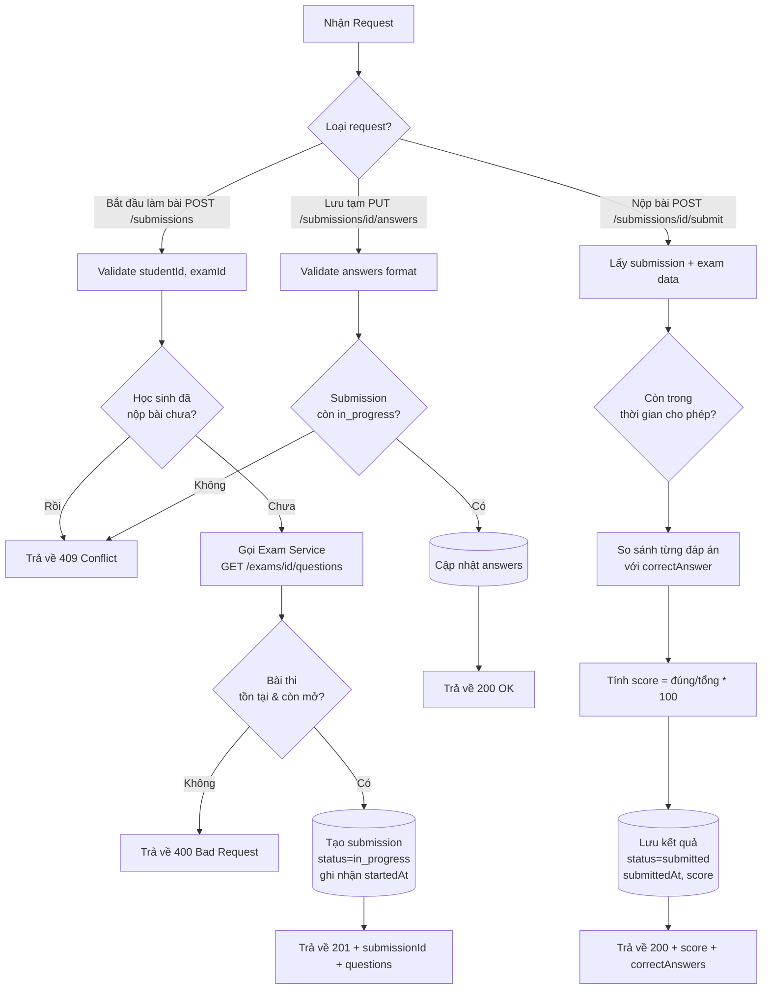
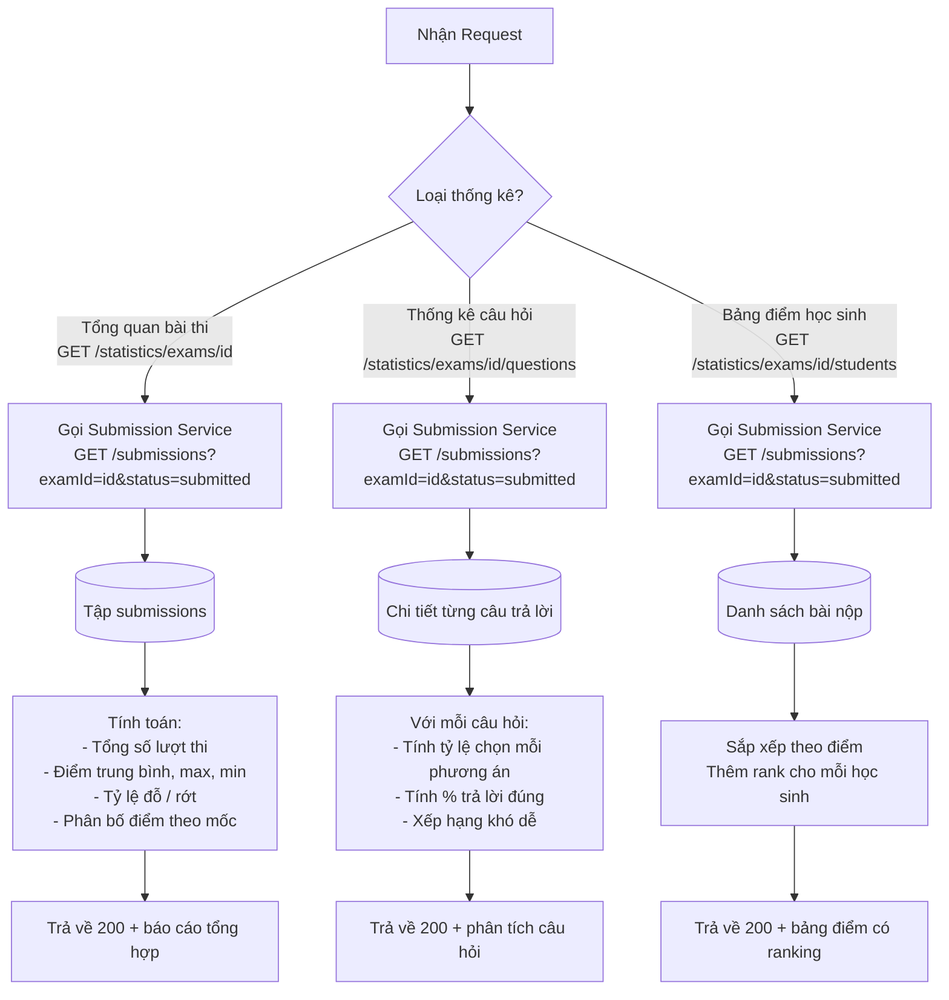
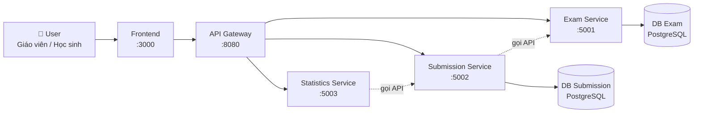

# Phân Tích và Thiết Kế — Hệ Thống Thi Trắc Nghiệm Online

> **Mục tiêu**: Phân tích quy trình nghiệp vụ và thiết kế giải pháp tự động hóa theo hướng dịch vụ (SOA/Microservices).
> Phạm vi: Hệ thống cho phép giáo viên tạo bài thi trắc nghiệm, học sinh làm bài và xem thống kê kết quả.

**Tài liệu tham khảo:**
1. *Service-Oriented Architecture: Analysis and Design for Services and Microservices* — Thomas Erl (2nd Edition)
2. *Microservices Patterns: With Examples in Java* — Chris Richardson
3. *Bài tập — Phát triển phần mềm hướng dịch vụ* — Hung Dang

---

## Phần 1 — Chuẩn Bị Phân Tích

### 1.1 Định Nghĩa Quy Trình Nghiệp Vụ

- **Domain**: Giáo dục — Quản lý thi cử trực tuyến
- **Quy trình nghiệp vụ**: Tổ chức thi trắc nghiệm online — từ khâu tạo đề thi, học sinh thực hiện làm bài đến chấm điểm tự động và thống kê kết quả
- **Actors**:
  - **Giáo viên**: Tạo câu hỏi, tạo và công bố bài thi, xem kết quả và thống kê
  - **Học sinh**: Đăng nhập, chọn bài thi, làm bài, nộp bài và xem điểm cá nhân
  - **Hệ thống**: Tự động chấm điểm, tổng hợp và sinh báo cáo
- **Phạm vi**: Bao gồm toàn bộ vòng đời của một kỳ thi — tạo đề → tổ chức thi → chấm điểm → báo cáo. Không bao gồm: quản lý người dùng/đăng nhập phức tạp (giả sử đã có), thanh toán, quản lý lớp học.

**Sơ đồ quy trình (BPMN):**



*(Lưu sơ đồ vào `docs/asset/` nếu cần xuất file ảnh)*

---

### 1.2 Hệ Thống Tự Động Hóa Hiện Có

| Tên hệ thống | Loại | Vai trò hiện tại | Phương thức tương tác |
|---|---|---|---|
| — | — | — | — |

> *Không có — Quy trình hiện đang được thực hiện thủ công .*

---

### 1.3 Yêu Cầu Phi Chức Năng

Các yêu cầu phi chức năng này là đầu vào để xác định **Utility Service** và **Microservice Candidate** ở bước 2.7.

| Yêu cầu | Mô tả |
|---|---|
| **Hiệu năng** | Hệ thống phải xử lý được nhiều học sinh làm bài đồng thời; API trả lời trong < 500ms với tải thông thường |
| **Bảo mật** | Ngăn chặn gian lận: mỗi học sinh chỉ được nộp bài một lần; bài thi chỉ hiển thị khi đã công bố; chỉ giáo viên mới tạo được đề |
| **Khả năng mở rộng** | Service làm bài thi và thống kê cần scale độc lập khi số lượng học sinh lớn |
| **Khả dụng** | Không để mất dữ liệu bài thi đang làm; nếu lỡ mất kết nối học sinh vẫn có thể tiếp tục từ bài đã trả lời |

---

## Phần 2 — Mô Hình Hóa REST/Microservices

### 2.1 Phân Rã Quy Trình Nghiệp Vụ & 2.2 Lọc Các Hành Động Không Phù Hợp

Phân rã quy trình từ mục 1.1 thành các hành động chi tiết. Đánh dấu các hành động không phù hợp để bao gói thành service.

| # | Hành động | Tác nhân | Mô tả | Phù hợp? |
|---|---|---|---|---|
| 1 | Tạo câu hỏi | Giáo viên | Tạo câu hỏi trắc nghiệm với 4 lựa chọn, đánh dấu đáp án đúng | ✅ |
| 2 | Sửa/xóa câu hỏi | Giáo viên | Chỉnh sửa nội dung hoặc xóa câu hỏi đã tạo | ✅ |
| 3 | Xem danh sách câu hỏi | Giáo viên | Tra cứu ngân hàng câu hỏi | ✅ |
| 4 | Tạo bài thi | Giáo viên | Đặt tiêu đề, mô tả, thời gian làm bài, chọn câu hỏi | ✅ |
| 5 | Cấu hình bài thi | Giáo viên | Thiết lập số lần thử, shuffle câu hỏi, thời hạn | ✅ |
| 6 | Công bố bài thi | Giáo viên | Chuyển trạng thái bài thi từ "nháp" sang "công bố" | ✅ |
| 7 | Đóng bài thi | Giáo viên | Ngừng nhận bài nộp | ✅ |
| 8 | Ra đề bằng trực giác sư phạm | Giáo viên | Suy nghĩ và quyết định câu hỏi phù hợp với trình độ học sinh | ❌ |
| 9 | Xem danh sách bài thi | Học sinh | Xem tất cả bài thi đang mở cho mình | ✅ |
| 10 | Bắt đầu làm bài | Học sinh | Khởi tạo phiên làm bài, ghi nhận thời gian bắt đầu | ✅ |
| 11 | Trả lời câu hỏi | Học sinh | Chọn phương án A/B/C/D cho mỗi câu hỏi | ✅ |
| 12 | Suy nghĩ lựa chọn đáp án | Học sinh | Quá trình nhận thức, đánh giá các phương án | ❌ |
| 13 | Lưu tạm bài làm | Học sinh | Lưu tiến trình đang làm để tiếp tục sau | ✅ |
| 14 | Nộp bài | Học sinh | Xác nhận nộp bài, hệ thống ghi nhận thời gian nộp | ✅ |
| 15 | Chấm điểm tự động | Hệ thống | So sánh đáp án học sinh với đáp án đúng, tính điểm | ✅ |
| 16 | Xem điểm và đáp án | Học sinh | Xem kết quả cá nhân sau khi nộp | ✅ |
| 17 | Tổng hợp thống kê bài thi | Hệ thống | Tính điểm trung bình, cao nhất, thấp nhất, phân bố điểm | ✅ |
| 18 | Thống kê theo câu hỏi | Hệ thống | Tỷ lệ đúng/sai cho từng câu hỏi | ✅ |
| 19 | Xuất báo cáo kết quả | Giáo viên | Xem danh sách học sinh và điểm theo bài thi | ✅ |

> Các hành động đánh dấu ❌ (số 8, 12): chỉ có thể thực hiện bởi con người, cần phán đoán chủ quan — không thể bao gói thành service.

---

### 2.3 Candidate Service Thực Thể (Entity Service Candidates)

Xác định các thực thể nghiệp vụ và nhóm các hành động tái sử dụng được (agnostic) thành Entity Service Candidate.

| Thực thể | Service Candidate | Các hành động Agnostic |
|---|---|---|
| **Câu hỏi** (Question) | Exam Service | Tạo câu hỏi (1), Sửa/xóa câu hỏi (2), Xem danh sách câu hỏi (3) |
| **Bài thi** (Exam) | Exam Service | Tạo bài thi (4), Cấu hình bài thi (5), Công bố bài thi (6), Đóng bài thi (7), Xem danh sách bài thi (9) |
| **Bài nộp** (Submission) | Submission Service | Bắt đầu làm bài (10), Trả lời câu hỏi (11), Lưu tạm bài làm (13), Nộp bài (14), Xem điểm và đáp án (16) |

---

### 2.4 Candidate Service Tác Vụ (Task Service Candidates)

Nhóm các hành động đặc thù theo quy trình (non-agnostic) thành Task Service Candidate.

| Hành động Non-Agnostic | Task Service Candidate |
|---|---|
| Chấm điểm tự động (15) — điều phối so sánh đáp án và lưu kết quả | **Submission Service** (tích hợp luồng chấm điểm ngay lúc nộp bài) |
| Tổng hợp thống kê bài thi (17) — tính toán KPIs từ nhiều bài nộp | **Statistics Service** |
| Thống kê theo câu hỏi (18) — phân tích tỷ lệ đúng/sai từng câu | **Statistics Service** |
| Xuất báo cáo kết quả (19) — tổng hợp dữ liệu cho giáo viên | **Statistics Service** |

---

### 2.5 Xác Định Tài Nguyên (Resources)

Ánh xạ các thực thể/quy trình sang REST URI Resources.

| Thực thể / Quy trình | Resource URI |
|---|---|
| Câu hỏi | `/questions` |
| Bài thi | `/exams` |
| Trạng thái bài thi (công bố/đóng) | `/exams/{examId}/status` |
| Câu hỏi thuộc bài thi | `/exams/{examId}/questions` |
| Phiên làm bài | `/submissions` |
| Bài nộp cụ thể | `/submissions/{submissionId}` |
| Nộp bài | `/submissions/{submissionId}/submit` |
| Thống kê tổng quan bài thi | `/statistics/exams/{examId}` |
| Thống kê từng câu hỏi | `/statistics/exams/{examId}/questions` |
| Bảng điểm học sinh theo bài thi | `/statistics/exams/{examId}/students` |

---

### 2.6 Liên Kết Khả Năng với Tài Nguyên và Phương Thức HTTP

| Service Candidate | Tên Capability | Resource | HTTP Method |
|---|---|---|---|
| **Exam Service** | Tạo câu hỏi | `/questions` | POST |
| **Exam Service** | Xem danh sách câu hỏi | `/questions` | GET |
| **Exam Service** | Sửa câu hỏi | `/questions/{id}` | PUT |
| **Exam Service** | Xóa câu hỏi | `/questions/{id}` | DELETE |
| **Exam Service** | Tạo bài thi | `/exams` | POST |
| **Exam Service** | Xem danh sách bài thi | `/exams` | GET |
| **Exam Service** | Xem chi tiết bài thi | `/exams/{examId}` | GET |
| **Exam Service** | Cập nhật bài thi | `/exams/{examId}` | PUT |
| **Exam Service** | Công bố / Đóng bài thi | `/exams/{examId}/status` | PATCH |
| **Exam Service** | Xem câu hỏi của bài thi | `/exams/{examId}/questions` | GET |
| **Submission Service** | Bắt đầu làm bài (tạo phiên) | `/submissions` | POST |
| **Submission Service** | Lưu câu trả lời tạm thời | `/submissions/{id}/answers` | PUT |
| **Submission Service** | Nộp bài & chấm điểm | `/submissions/{id}/submit` | POST |
| **Submission Service** | Xem kết quả cá nhân | `/submissions/{id}` | GET |
| **Submission Service** | Xem lịch sử làm bài | `/submissions?studentId=...` | GET |
| **Statistics Service** | Thống kê tổng quan bài thi | `/statistics/exams/{examId}` | GET |
| **Statistics Service** | Thống kê theo từng câu hỏi | `/statistics/exams/{examId}/questions` | GET |
| **Statistics Service** | Bảng điểm học sinh | `/statistics/exams/{examId}/students` | GET |

---

### 2.7 Utility Service & Microservice Candidates

Dựa trên Yêu Cầu Phi Chức Năng (1.3) và yêu cầu xử lý, xác định logic cắt ngang hoặc logic cần tính tự chủ/hiệu năng cao.

| Candidate | Loại | Lý do |
|---|---|---|
| **Exam Service** | Entity Microservice | Owning câu hỏi và bài thi — logic ổn định, scale độc lập với submission |
| **Submission Service** | Task + Entity Microservice | Xử lý đồng thời cao khi nhiều học sinh làm bài cùng lúc; tích hợp luồng chấm điểm; cần scale linh hoạt theo tải |
| **Statistics Service** | Utility Microservice | Logic tổng hợp tách biệt, chỉ đọc dữ liệu từ Submission Service; có thể cache nặng; không ảnh hưởng đến quá trình làm bài nếu chậm |

---

### 2.8 Service Composition Candidates

Sơ đồ tương tác giữa các Service Candidate để thực hiện quy trình nghiệp vụ.

**Luồng 1: Học sinh làm bài và nộp bài**



**Luồng 2: Giáo viên xem thống kê**



**Luồng 3: Giáo viên tạo bài thi**



---

## Phần 3 — Thiết Kế Hướng Dịch Vụ

### 3.1 Thiết Kế Hợp Đồng Thống Nhất (Uniform Contract Design)

Đặc tả hợp đồng dịch vụ cho từng service. Spec đầy đủ:
- [`docs/api-specs/exam-service.yaml`](api-specs/exam-service.yaml)
- [`docs/api-specs/submission-service.yaml`](api-specs/submission-service.yaml)
- [`docs/api-specs/statistics-service.yaml`](api-specs/statistics-service.yaml)

**Exam Service** *(Port: 5001)*:

| Endpoint | Method | Media Type | Mã phản hồi |
|---|---|---|---|
| `/health` | GET | `application/json` | 200 |
| `/questions` | GET | `application/json` | 200 |
| `/questions` | POST | `application/json` | 201, 400 |
| `/questions/{id}` | GET | `application/json` | 200, 404 |
| `/questions/{id}` | PUT | `application/json` | 200, 400, 404 |
| `/questions/{id}` | DELETE | `application/json` | 204, 404 |
| `/exams` | GET | `application/json` | 200 |
| `/exams` | POST | `application/json` | 201, 400 |
| `/exams/{examId}` | GET | `application/json` | 200, 404 |
| `/exams/{examId}` | PUT | `application/json` | 200, 400, 404 |
| `/exams/{examId}/status` | PATCH | `application/json` | 200, 400, 404 |
| `/exams/{examId}/questions` | GET | `application/json` | 200, 404 |

**Submission Service** *(Port: 5002)*:

| Endpoint | Method | Media Type | Mã phản hồi |
|---|---|---|---|
| `/health` | GET | `application/json` | 200 |
| `/submissions` | POST | `application/json` | 201, 400, 409 |
| `/submissions` | GET | `application/json` | 200 |
| `/submissions/{id}` | GET | `application/json` | 200, 404 |
| `/submissions/{id}/answers` | PUT | `application/json` | 200, 400, 404 |
| `/submissions/{id}/submit` | POST | `application/json` | 200, 400, 404, 409 |

**Statistics Service** *(Port: 5003)*:

| Endpoint | Method | Media Type | Mã phản hồi |
|---|---|---|---|
| `/health` | GET | `application/json` | 200 |
| `/statistics/exams/{examId}` | GET | `application/json` | 200, 404 |
| `/statistics/exams/{examId}/questions` | GET | `application/json` | 200, 404 |
| `/statistics/exams/{examId}/students` | GET | `application/json` | 200, 404 |

---

### 3.2 Thiết Kế Logic Dịch Vụ (Service Logic Design)

Luồng xử lý nội bộ của từng service.

**Exam Service:**



**Submission Service:**



**Statistics Service:**



---

## Phụ Lục — Phân Công Công Việc Nhóm

### Sơ đồ kiến trúc tổng thể



### Phân công theo thành viên

| Thành viên | Phụ trách | Công việc chính |
|---|---|---|
| **Thành viên 1** | Exam Service + API Gateway | Implement CRUD câu hỏi, CRUD bài thi, công bố bài thi; cấu hình Gateway routing; viết OpenAPI spec |
| **Thành viên 2** | Submission Service + Frontend | Implement tạo phiên làm bài, lưu đáp án, nộp bài và chấm điểm tự động; xây dựng giao diện học sinh |
| **Thành viên 3** | Statistics Service + Frontend | Implement API thống kê và báo cáo; xây dựng giao diện giáo viên (dashboard thống kê) |

### Thứ tự ưu tiên triển khai (theo phase)

```
Phase 1 — Nền tảng (tất cả cùng làm trước):
  ├── Thiết kế DB schema cho từng service
  ├── Implement GET /health cho tất cả service
  └── Cấu hình docker-compose.yml với 3 service + DB

Phase 2 — Core API:
  ├── [TV1] Exam Service: CRUD /questions và /exams
  ├── [TV2] Submission Service: POST /submissions, PUT answers, POST submit
  └── [TV3] Statistics Service: GET /statistics/exams/{id}

Phase 3 — Tích hợp & Frontend:
  ├── [TV1] Cấu hình Gateway routing
  ├── [TV2] Frontend — trang học sinh làm bài
  ├── [TV3] Frontend — dashboard thống kê giáo viên
  └── [TẤT CẢ] Test end-to-end với docker compose up --build

Phase 4 — Hoàn thiện:
  ├── Cập nhật README.md và readme.md từng service
  ├── Cập nhật OpenAPI specs
  └── Kiểm tra Submission Checklist
```
