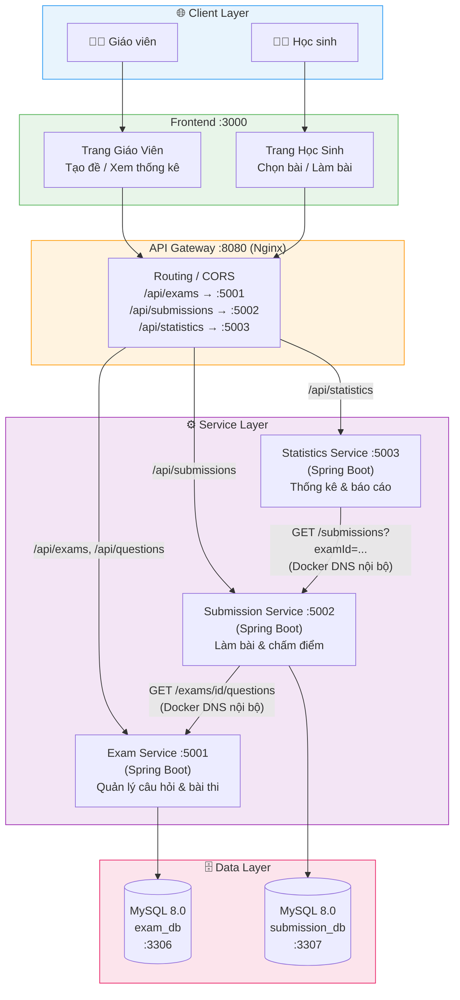
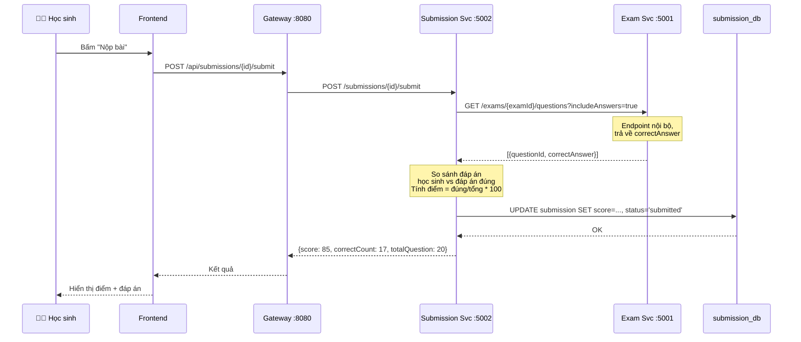
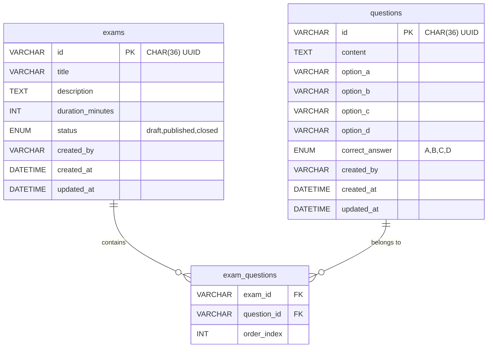
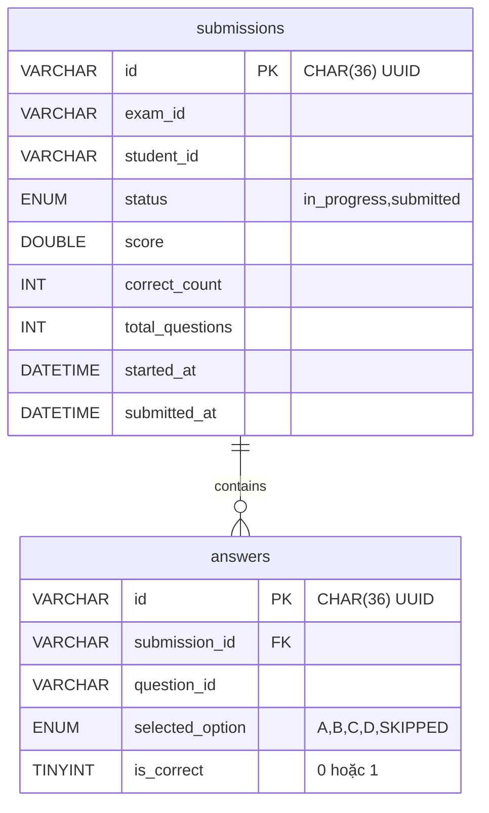

# Kiến Trúc Hệ Thống — Hệ Thống Thi Trắc Nghiệm Online

**Tài liệu tham khảo:**
1. *Service-Oriented Architecture: Analysis and Design for Services and Microservices* — Thomas Erl (2nd Edition)
2. *Microservices Patterns: With Examples in Java* — Chris Richardson
3. *Bài tập — Phát triển phần mềm hướng dịch vụ* — Hung Dang

---

## 1. Lựa Chọn Pattern Kiến Trúc

Lựa chọn pattern dựa trên kết quả phân tích nghiệp vụ và yêu cầu kỹ thuật.

| Pattern | Áp dụng? | Lý do kỹ thuật / Nghiệp vụ |
|---|---|---|
| **API Gateway** | ✅ Có | Cung cấp điểm vào duy nhất cho client; ẩn topology nội bộ; xử lý CORS tập trung; routing linh hoạt đến 3 service |
| **Database per Service** | ✅ Có | Mỗi service sở hữu dữ liệu riêng — Exam Service quản lý câu hỏi/bài thi, Submission Service quản lý bài nộp; đảm bảo loose coupling và có thể scale từng service độc lập |
| **Shared Database** | ❌ Không | Tạo coupling chặt giữa các service; vi phạm nguyên tắc service autonomy của SOA |
| **Saga** | ❌ Không | Không có distributed transaction phức tạp trong phạm vi bài tập này |
| **Event-driven / Message Queue** | ❌ Không | Giao tiếp đồng bộ HTTP đủ đáp ứng yêu cầu; tránh tăng độ phức tạp của hệ thống |
| **CQRS** | ❌ Không | Ngoài phạm vi bài tập; Statistics Service đóng vai trò read-side đơn giản bằng cách gọi API |
| **Circuit Breaker** | ⚠️ Khuyến nghị | Nên áp dụng khi Submission Service gọi Exam Service; tránh cascade failure khi một service bị lỗi (có thể implement bằng thư viện retry đơn giản) |
| **Service Registry / Discovery** | ❌ Không | Docker Compose DNS (`service-name`) đủ dùng trong môi trường development/lab |

> **Tham khảo**: *Microservices Patterns* — Chris Richardson, chương về decomposition, data management và communication patterns.

---

## 2. Các Thành Phần Hệ Thống

| Thành phần | Trách nhiệm | Tech Stack | Port (host) |
|---|---|---|---|
| **Frontend** | Giao diện người dùng — trang làm bài cho học sinh, dashboard thống kê cho giáo viên | React + Vite (hoặc Vue.js) | 3000 |
| **API Gateway** | Điểm vào duy nhất — routing request đến đúng service, xử lý CORS | Nginx (reverse proxy) | 8080 |
| **Exam Service** | Quản lý câu hỏi và bài thi — CRUD questions, xem,tạo, cập nhật bài thi, công bố/đóng bài thi | Java 17 + Spring Boot 3 + Spring Data JPA | 5001 |
| **Submission Service** | Quản lý phiên làm bài — tạo session, lưu đáp án, nộp bài, chấm điểm tự động | Java 17 + Spring Boot 3 + Spring Data JPA | 5002 |
| **Statistics Service** | Tổng hợp và báo cáo — thống kê bài thi, phân tích câu hỏi, bảng điểm | Java 17 + Spring Boot 3 + Spring WebClient | 5003 |
| **Database Exam** | Lưu trữ câu hỏi và bài thi | MySQL 8.0 | 3306 |
| **Database Submission** | Lưu trữ bài nộp và kết quả làm bài | MySQL 8.0 | 3307 |

> **Lưu ý**: Statistics Service **không có database riêng** — nó đọc dữ liệu qua API của Submission Service rồi tính toán realtime. Điều này hợp lý vì thống kê chỉ là derived data từ bài nộp.

---

## 3. Giao Tiếp Giữa Các Service

### Ma Trận Giao Tiếp

| Từ → Đến | Exam Service | Submission Service | Statistics Service | Gateway | DB Exam | DB Submission |
|---|---|---|---|---|---|---|
| **Frontend** | — | — | — | HTTP REST | — | — |
| **Gateway** | HTTP (routing) | HTTP (routing) | HTTP (routing) | — | — | — |
| **Exam Service** | — | — | — | — | Read/Write | — |
| **Submission Service** | HTTP (lấy đề thi & đáp án khi nộp bài) | — | — | — | — | Read/Write |
| **Statistics Service** | — | HTTP (lấy danh sách bài nộp để tổng hợp) | — | — | — | — |

### Quy Tắc Giao Tiếp

- **Frontend → Gateway**: Tất cả request đều qua Gateway, tiền tố `/api/`
- **Gateway → Services**: Nginx strip prefix và forward đến service tương ứng theo cổng nội bộ `8080` (Spring Boot mặc định)
- **Submission Service → Exam Service**: Gọi nội bộ qua Docker Compose DNS (`http://exam-service:8080`), **không qua Gateway**
- **Statistics Service → Submission Service**: Gọi nội bộ qua Docker Compose DNS (`http://submission-service:8080`), **không qua Gateway**; sử dụng `Spring WebClient` (reactive HTTP client)
- **Dữ liệu nhạy cảm**: `correctAnswer` của câu hỏi **chỉ** được Submission Service đọc khi chấm điểm; Frontend **không bao giờ** nhận được đáp án trước khi nộp bài

---

## 4. Sơ Đồ Kiến Trúc

> Đặt sơ đồ trong `docs/asset/` và tham chiếu tại đây.

### Sơ đồ tổng quan



### Luồng dữ liệu khi học sinh nộp bài



---

## 5. Schema Dữ Liệu

### exam_db (Exam Service) — MySQL



> **Lưu ý MySQL**: Dùng `CHAR(36)` cho UUID (MySQL 8.0 chưa có native UUID type). Dùng `ENUM` cho các trường có giá trị cố định. Spring Boot cấu hình `spring.jpa.hibernate.ddl-auto=update` để auto-create table.

### submission_db (Submission Service) — MySQL



---

## 6. Cấu Hình Triển Khai

### Docker Compose

Tất cả service được container hóa bằng Docker và điều phối qua Docker Compose:

```
docker compose up --build
```

### Cấu hình cổng

| Service | Container Port | Host Port | Ghi chú |
|---|---|---|---|
| frontend | 3000 | 3000 | React dev server |
| gateway (nginx) | 8000 | 8080 | Entry point duy nhất |
| exam-service | 8080 | 5001 | Spring Boot (mặc định 8080 trong container) |
| submission-service | 8080 | 5002 | Spring Boot (mặc định 8080 trong container) |
| statistics-service | 8080 | 5003 | Spring Boot (mặc định 8080 trong container) |
| exam-db | 3306 | 3306 | MySQL 8.0 |
| submission-db | 3306 | 3307 | MySQL 8.0 |

### Gateway Routing (Nginx)

```nginx
# /api/exams/* và /api/questions/* → exam-service (Spring Boot chạy trên 8080)
location /api/exams/ {
    proxy_pass http://exam-service:8080/exams/;
}
location /api/questions/ {
    proxy_pass http://exam-service:8080/questions/;
}

# /api/submissions/* → submission-service
location /api/submissions/ {
    proxy_pass http://submission-service:8080/submissions/;
}

# /api/statistics/* → statistics-service
location /api/statistics/ {
    proxy_pass http://statistics-service:8080/statistics/;
}
```

### Cấu hình Spring Boot quan trọng

Mỗi service cần có `src/main/resources/application.properties`:

```properties
# application.properties — ví dụ cho exam-service
server.port=8080

# MySQL datasource (lấy từ biến môi trường Docker)
spring.datasource.url=jdbc:mysql://${DB_HOST:exam-db}:3306/${DB_NAME:exam_db}?useSSL=false&allowPublicKeyRetrieval=true&serverTimezone=UTC
spring.datasource.username=${DB_USER:root}
spring.datasource.password=${DB_PASSWORD:changeme}
spring.datasource.driver-class-name=com.mysql.cj.jdbc.Driver

# JPA / Hibernate
spring.jpa.hibernate.ddl-auto=update
spring.jpa.show-sql=false
spring.jpa.properties.hibernate.dialect=org.hibernate.dialect.MySQLDialect

# Health check endpoint (tùy chỉnh thành /health thay vì /actuator/health)
management.endpoints.web.base-path=/
management.endpoints.web.path-mapping.health=health
```

### Health Check Endpoints

```bash
# Kiểm tra tất cả service
curl http://localhost:8080/api/exams/health      # Exam Service
curl http://localhost:8080/api/submissions/health # Submission Service
curl http://localhost:8080/api/statistics/health  # Statistics Service

# Hoặc gọi trực tiếp (bỏ qua gateway)
curl http://localhost:5001/health
curl http://localhost:5002/health
curl http://localhost:5003/health
```
